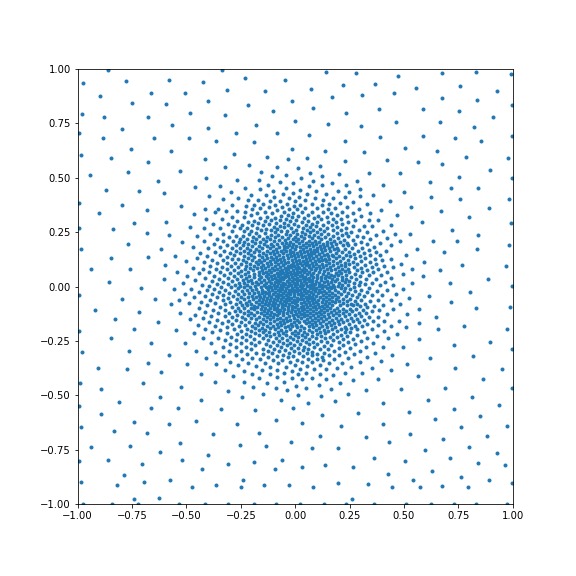
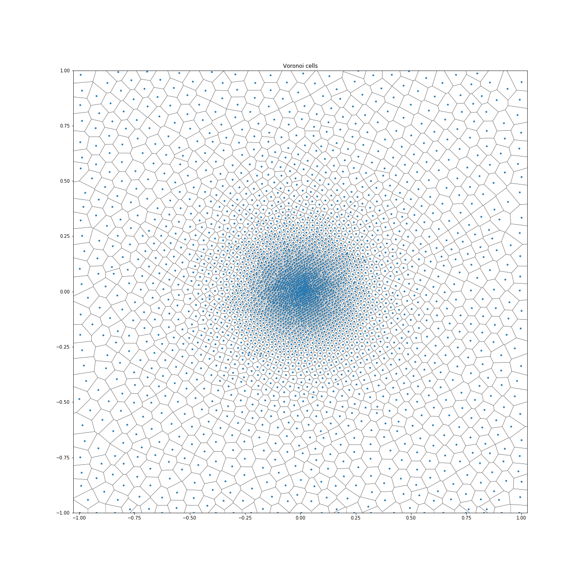
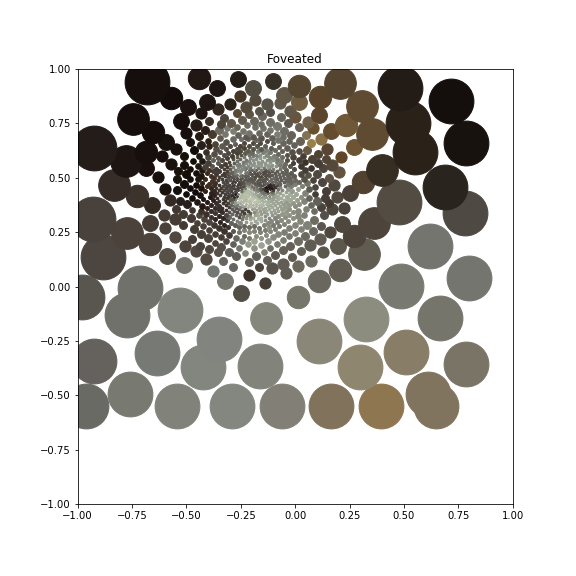

# Fast generation of points from arbitrary density functions

Implements the "Fast generation of 2-D node distributions for mesh-free PDE discretizations" algorithm by [Fornberg and Flyer] (see: https://amath.colorado.edu/faculty/fornberg/Docs/2015_FF_Node_placing_CMA.pdf)

>Fornberg, B., & Flyer, N. (2015). Fast generation of 2-D node distributions for mesh-free PDE discretizations. Computers & Mathematics with Applications, 69(7), 531-544.

This only implements the code for laying out points in a rectangular domain. The paper presents a method for an iterative repulsion model to clean up edges when non-rectangular regions are cut out; this is not implemented here.

## Usage
Simply pass a function returning the number of points per unit area at a given point to `moving_front_nodes`:

        # simple function; flat everywhere, with dense point in the centre
        def density_fn(x,y):    
                return np.maximum(100, (5000.0*np.exp(-((x**2+y**2)*10.0))))
                
        nodes = moving_front_nodes(density_fn, (-1,-1,1,1))

    

## Demos

See [VariableDensity.ipynb] for some basic tests of the uniformity of the layout. 

See [PyrRetina.ipynb] for an application in building a simple foveated (retinal) transform for imaging purposes using the layout algorithm.

